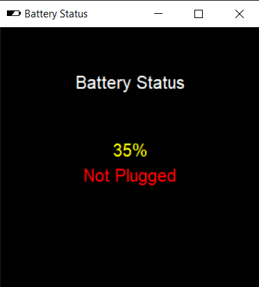

# Tkinter Battery Status
A `psutil` Python code to get the battery status and display them in a Tkinter window <br> <br>
 <br>
This software can detect if the power battery was plugged or not, if yes, it will show plugged in green text, if not, it will show not plugged in red text. Also it will show battery percentage in three different colors depending on the percent.
* Green if more than 50%
* Yellow if less than 50%
* Red if less than 20%
<br>
psutil (python system and process utilities) is a cross-platform library for retrieving information on running processes and system utilization (CPU, memory, disks, network, sensors) in Python. <br>
To download `psutil` using pip:
```
pip install psutil
```
also to download Tkinter for window UI:
```
pip install tkinter
```
